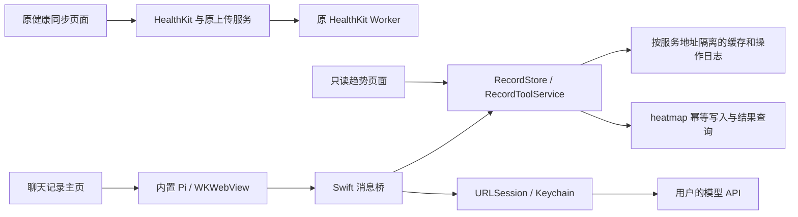

# 个人记录与本机 Pi 助手

实现分支：HealthKitSync 和 heatmap 均为 `codex/personal-records-agent`，从各自的 `main` 创建。原有未跟踪的 Xcode workspace 保留。首次实现阶段仅进行了本地和隔离验证；2026-09-19 后续已按用户明确授权完成 heatmap 生产备份、增量迁移及 Worker 发布。发布核验确认原有 234 条记录保持一致，详情在 heatmap 仓库 `worker/PRODUCTION_RELEASE_2026-09-19.md`。

## 使用方式

App 默认打开「记录」聊天页，底部顺序为记录、趋势、健康同步、设置。记录和趋势不要求健康授权。

- 顶部仅显示今天俯卧撑次数和平板时长；包含待同步新增。下拉同步，网络异常时提供重试、缓存时间和停止入口。
- 可使用系统键盘，也可按住输入栏麦克风说话；松开后文字留在草稿中，确认后手动发送。语音入口不弹键盘。没有手动新增或编辑表单。
- 「趋势」按月份显示俯卧撑或平板的热力图/柱状图；点选日期展开只读明细。通过「在对话中处理」携带实际 ID 返回输入栏，不自动发送。
- 热力图每周从周一开始；无记录不等于运动量为零。俯卧撑和平板始终分别统计。图表、今日汇总和助手工具共用原生记录缓存。
- 查询卡片保存当次快照；「刷新查询」使用原条件追加新结果，保留输入草稿。模型不能提交图表数值，刷新请求也不能修改记录。
- 会话按北京时间每日清理，也可手动重置。文字草稿和防重复操作日志保留，待处理引用清除。切换页面不取消助手请求，进入后台或主动停止才中断。
- 同步记录修改和删除需要联网核对；引用目标不存在时明确报错，不选择另一条替代。

## 配置

「设置 → 健康运动上传设置」继续使用原有 URL、上传 Token 和 HealthKit UUID 去重规则。

「heatmap 数据服务」填写 **基础地址**，例如 `https://fitness.example.com`，不要填 `/api/records`。填写该服务的 `FITNESS_API_TOKEN`；需要 Cloudflare Access 时同时填写 Client ID 和 Secret。需先上线 heatmap 的 `0002_write_operations.sql` 及新接口，旧服务缺少操作查询接口时 App 会保留待同步记录并报错，不会冒险重复提交。

「文本助手」填写支持流式工具调用的 Chat Completions 兼容 API 基础地址（通常以 `/v1` 结尾）、API Key 和模型名。模型在远端运行；Pi 的对话循环和工具调度在 iPhone 内置 WKWebView 运行。三套凭据互不复用，保存于 Keychain。输入文本和工具查询结果会发往用户配置的模型服务；不会向助手提供 HealthKit 运动或健康上传凭据。

模型配置可以留空，缓存浏览和健康上传继续可用；新增记录需要模型。无网或模型失败时保留文本，不假装已理解或已保存。

## 模块边界



- `agent-runtime/`：Pi `0.85.1` 的浏览器打包、工具参数定义、流式事件、会话恢复。只使用 `pi-agent-core` 和 `pi-ai` 的必要模块，不使用完整 coding-agent SDK、任意 Skills 或 shell 工具。
- `HealthKitSync/Services/PiBridge.swift`：独立 WKWebView，禁止页面直接联网/导航，仅允许向配置的模型端点 POST；原生注入 Key，不向 JavaScript 传 Key；拒绝重定向，支持取消和流式 UTF-8 字节传递。
- `HealthKitSync/Records/`：输入校验、Asia/Shanghai 日期、分类复用、操作日志、远端接口与按代码计算的汇总。四个 Agent 工具和趋势页共用这一层。
- `AssistantStore`：保存输入、聊天卡片、Pi 消息及尚未完成的请求 ID。进后台取消模型请求，前台恢复历史，不自动重放提示词或工具。

日期默认上海时区，每周从周一开始。俯卧撑为正整数，平板为正秒数。“三组每组二十个”作为总计 60 个保存并保留输入原文。系统提示要求区分新增与日累计，目标含糊时追问；该语义仍需真实模型验收。

## 去重和恢复约定

新增或修改都有原生 UUID 操作 ID。首次提交前将 ID 和请求内容一起持久化，之后重试始终使用相同 ID 和相同内容。服务端在同一个 D1 batch 事务中提交操作回执和数据；重复请求返回原响应，内容冲突返回 409。

响应丢失后，先用 `GET /api/operations/:key` 核对，只有明确的 `404 operation_not_found` 才重发。未知提交完成前不替换明细缓存，避免远端记录与本机临时行重复计入。操作完成时合并服务端真实记录 ID，再刷新完整缓存。

助手同一轮的全部新增必须合并到一次工具调用。同一轮重试即使模型换了 tool-call ID，原生操作来源 ID 仍不变；若重试参数不同会报错，不会多记一笔。会话中断留下的未配对工具调用会补充“结果未知”的错误消息，恢复动作本身不会执行工具。

缓存损坏时保留原文件并阻止覆盖。401、参数失败和冲突都显示错误；不会把失败请求当成已上传。缓存合计包含本机待同步新增，并标出缓存更新时间。

## 构建与测试

Node.js >= 22.19；Xcode 工程继续支持 iOS 17+。

```bash
cd agent-runtime
npm ci
npm run check
npm test
npm run build
```

生成的 `HealthKitSync/Resources/Agent/runtime.js` 和 `licenses.txt` 一并提交，可直接使用 Xcode 构建。修改 TypeScript 后须重建资源。锁文件固定全部依赖，构建不会在手机上下载可执行代码。

原生状态测试：

```bash
swift test
```

跨仓库 HTTP + 临时 D1 联调，两个终端分别执行；每轮联调重新启动测试服务器以获得空数据库：

```bash
# heatmap 仓库，依赖安装后
node worker/test/local-server.mjs

# HealthKitSync 仓库
PERSONAL_RECORDS_TEST_URL=http://127.0.0.1:18787 swift test
```

测试服务器只监听本机，不持久化数据库，不绑定生产资源。原生测试在真实 POST 响应返回后主动丢弃一次响应，再从磁盘恢复并核对服务端回执。

健康 Worker 回归：按 `cloudflare/README.md` 准备本地 `.dev.vars` 后运行 `npm test` 和 `npm run check`。测试自身使用固定测试 Token，不依赖个人凭据。

真机/模拟器 Debug 构建使用启动参数 `--agent-probe`，执行隔离探针；它不读取个人服务配置，模型 SSE 和记录服务均使用 fixture。报告保存到 App 的 `Documents/pi-probe-result.json`。Release 不包含该探针入口。

## 本次验证记录（2026-09-19）

| 验证 | 结果 |
|---|---|
| Pi 浏览器构建、TypeScript 检查、2 项运行时测试 | 通过 |
| 原生状态测试 + 实际 HTTP/D1 联调，共 4 项 | 通过；未启动测试服务器时联调项明确跳过 |
| heatmap 原有与新增测试，共 11 项 | 通过 |
| heatmap Worker dry-run、lint | 通过；后续生产发布见上述独立发布记录 |
| 原健康 Worker 6 项测试与 TypeScript 检查 | 通过；生成类型核对报告 up to date |
| iPhone 13 Pro / iOS 27.0，Pi + 原生工具探针 | 通过，见 `pi-device-probe-2026-09-19.json` |
| iOS Debug 真机/模拟器构建与 Release 构建 | 通过；原 HealthKit 路线回调已有 Swift 并发警告未在本次改动 |

真机探针覆盖：中文流式响应、两条新增、保存后响应丢失、按回执恢复、磁盘会话恢复、运行环境重建、按原 ID 纠正、查询汇总、取消。浏览器测试另覆盖 UTF-8 拆分和中断工具消息修复。

**待验收：** 本次未提供真实模型端点和 Key，所以未验证真实模型对中文累计/追问/纠正的理解，也未将 iPhone 连接到部署后的测试 Worker。真机完整流程使用 fixture，原生到真实 D1 的 HTTP 联调在 macOS 测试宿主完成。手机实际进后台、杀进程后的完整交互、UI 手动验收和实际 HealthKit 上传仍需在配置测试服务后完成；界面自动化工具未能连接 Xcode Device Hub。本次没有运行生产上传。

## 上线顺序

1. 在 heatmap 的独立测试环境应用增量迁移并部署分支；参考该仓库 `worker/PERSONAL_RECORDS.md`。
2. App 填测试 heatmap 和真实模型配置，完成上述待验收项。重点测试“今天一共 20 个”应查询/澄清，“又做了 20 个”应新增，以及鉴权错误、断网和前后台切换。
3. 验收通过后再安排生产数据库备份、迁移和 Worker 发布，然后发布 App。保持原 HealthKit Worker 配置和凭据不变。

## 同步报 `404 Not found`

如果 `/api/activities` 正常，但 `/api/operations/<操作 ID>` 返回 `404 Not found`，说明线上 Worker 缺少新版操作核对接口。2026-09-19 曾在现有服务上复现此情况，Access 验证通过；该线上缺口现已通过同日后端发布修复。已有 App 配置无需修改，待同步记录可直接重试。

App 现在会明确提示服务需要升级。未提交的记录继续保存在本机，仍可读取旧服务的已有记录；如果某笔写入结果未知则保持原缓存，以免重复计数。待后端迁移和发布完成后，点「同步记录」会使用原操作 ID 重试，不需要重新录入。

新增两个回归测试验证旧服务下不会发送写请求、记录重启后仍保留、升级后只提交一次，以及服务回滚时不会重复合并未知写入。后端发布需包含 `0002_write_operations.sql` 和对应 Worker，两者缺一不可。

不在本版范围：本地模型推理、后台持续 Agent、独立语音、计时器、任意 Skills、批量删除。对话不自动压缩，长会话超出模型上下文时会显示模型错误；正式长期使用前可追加会话管理功能。

参考：[Pi SDK](https://pi.dev/docs/latest/sdk)、[锁定版本源码](https://github.com/earendil-works/pi/tree/v0.85.1)、[D1 batch](https://developers.cloudflare.com/d1/worker-api/d1-database/#batch)。

## Chat 优先改版验证

本轮仅修改 HealthKitSync，不修改 heatmap 接口、配置或生产数据。新增 `query_entries` 可选参数 `activity`（pushups/plank）与 `presentation`（list/heatmap/bar），旧调用默认列表。原生快照保存日期范围、分类、每日总量、明细真实 ID、查询和缓存时间。

Debug 启动参数 `--records-preview` 提供隔离的本机图表样本，用于视觉与引用流程验收；数据存放临时目录，传输始终返回离线错误。`--agent-probe` 新增热力图结构和数值的原生桥接校验。Release 不包含两个测试入口。

改版检查结果：原生 20 项测试中 19 项通过，实际 D1 联调因本轮未启动测试服务而跳过；Pi 4 项测试、类型检查和内置包构建通过；原健康 Worker 6 项测试和类型检查通过。Debug 真机、模拟器及 Release 构建通过。iPhone 13 Pro / iOS 27 的隔离探针通过，包括热力图原生数值、流式回复、运行环境重建、丢失响应去重、多轮纠正和取消。

模拟器检查涵盖热力图、柱状图、日期明细、带引用返回聊天、深色模式、大字号和减少动态效果；修复了日历格收缩和柱状图日期标签重叠。图表单元格具备日期、真实数量/无记录及待同步的无障碍描述。

最终版在已连接 iPhone 上正常启动后，记录缓存成功刷新（核验时距刷新约 36 秒），确认本轮手机读取线上 heatmap 成功。模拟器正常入口也验证了四项导航、未配置模型的空首页、输入与收起键盘。

尚需实际使用核对：用户模型对中文查询意图的选择，以及 VoiceOver 完整手势体验。本轮没有更改网络、Access、域名或 heatmap 后端，也没有用真实记录做修改/删除验收。

## 按住说话

输入栏的麦克风使用苹果 Speech 与 AVAudioEngine。按住开始、松开结束，部分识别结果原地显示，最多录音 55 秒。首次授权后需要再次按住；录音和最终识别期间不能发送。原有草稿保留，识别文字追加到末尾；取消、拒绝权限或识别失败时恢复原草稿。切换页面、进入后台或音频中断时释放麦克风。VoiceOver 双击开始，再次双击结束。

优先使用设备端中文识别；设备不支持时可由苹果语音服务处理，需要麦克风和语音识别权限。App 不保存音频文件、不新增服务器，语音不会直接交给 Pi 或自动提交记录。

真机和模拟器 Debug 编译通过，并核对了生成的两项权限声明。模拟器确认麦克风入口不会弹键盘，首次权限弹窗和拒绝权限后的恢复提示正常。实际中文录音识别质量仍需在手机首次授权后试用。

### 语音授权闪退修复

真机崩溃堆栈确认：`SFSpeechRecognizer.requestAuthorization` 在后台队列回调，Swift 6 将原闭包推断为 MainActor 隔离，触发 `_dispatch_assert_queue_fail`。授权、音频 tap 和识别结果闭包均明确标为 `@Sendable`；界面状态仍只在 MainActor 更新。

Debug 启动参数 `--dictation-probe` 在已有授权时连续三次调用真实系统授权流程，并在回调前模拟松手。iPhone 验证通过，未录音、未改动记录，原草稿保留。未授权时探针直接跳过，不主动申请权限。完整说话识别仍需实际使用确认。
